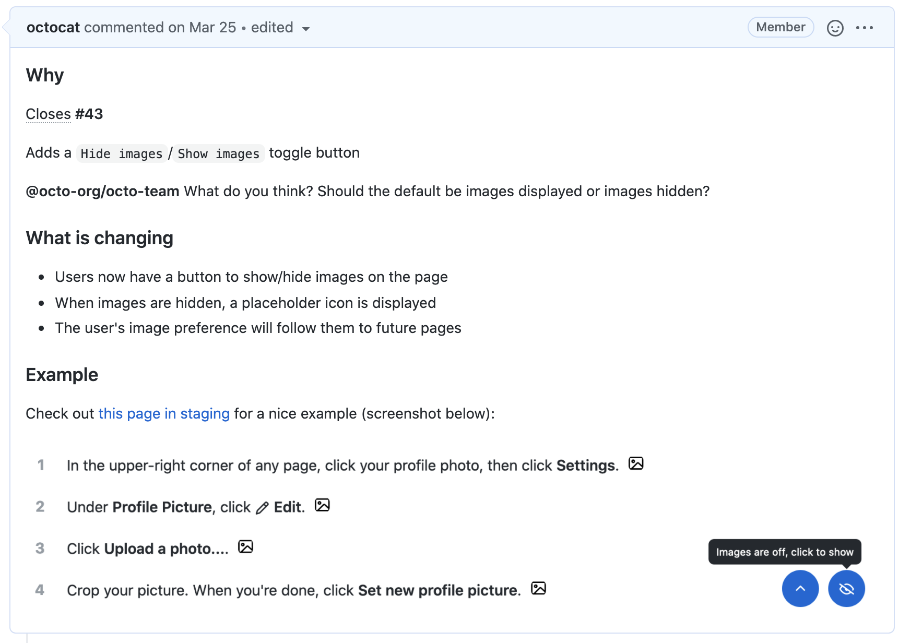

# **Table of contents**

[**1. Coding convention**]()

- [1. Folder, file name convention]()
- [2. Typescript convention]()
- [3. CSS naming convention & styling order]()
- [4. HTML tag convention]()
- [5. Git flow and commit convention]()

[**2. Tools and librarys**]()

- [1. ESLint & Prettier]()
- [2. Husky & Commitlint]()
- [3. Stylelint]()
- [4. VSCode shared configuration]()

# **1. Coding convention**

## **1.5 Git flow and commit convention**

### **Git flow**

> Rule: Every feature and hotfix branch will be **checkout from** and **merge to** master branch

- **Create a branch**

  Branch name will follow with `[type]/[jira-id-with-title]`

  ```bash
  git checkout master
  git pull
  git checkout -b feat/cms-115-update-header-component # Branch will be feat/cms-115-update-header-component
  ```

- **Make changes**

  After change or update source code, moving to commit step

  ```bash
  git add .
  git commit -m "feat: do something"
  git push -u feat/cms-115-update-header-component
  ```

- **Create a pull request**

  Create a pull request to ask collaborators for feedback on your changes. Pull request review is so valuable that some repositories require an approving review before pull requests can be merged. If you want early feedback or advice before you complete your changes, you can mark your pull request as a draft.
  
  


### **Commit convention**

The Conventional Commits specification is a lightweight convention on top of commit messages. It provides an easy set of rules for creating an explicit commit history; which makes it easier to write automated tools on top of. This convention dovetails with SemVer, by describing the features, fixes, and breaking changes made in commit messages.

The commit message should be structured as follows:

```bash
<type>[optional scope]: <description>

[optional body]

[optional footer(s)]
```

The commit contains the following structural elements, to communicate intent to the consumers of your library:

- **fix:** a commit of the type fix patches a bug in your codebase (this correlates with PATCH in Semantic Versioning).
- **feat:** a commit of the type feat introduces a new feature to the codebase (this correlates with MINOR in Semantic Versioning).
- **BREAKING CHANGE:** a commit that has a footer BREAKING CHANGE:, or appends a ! after the type/scope, introduces a breaking API change (correlating with MAJOR in Semantic Versioning). A BREAKING CHANGE can be part of commits of any type.
- types other than `fix:` and `feat:` are allowed, for example @commitlint/config-conventional (based on the the Angular convention) recommends `build:`, `chore:`, `ci:`, `docs:`, `style:`, `refactor:`, `perf:`, `test:`, and others.
- footers other than BREAKING CHANGE: <description> may be provided and follow a convention similar to git trailer format.

Additional types are not mandated by the Conventional Commits specification, and have no implicit effect in Semantic Versioning (unless they include a BREAKING CHANGE). A scope may be provided to a commit’s type, to provide additional contextual information and is contained within parenthesis, e.g., feat(parser): add ability to parse arrays.

Example:

```bash
git commit -m "docs: correct spelling of CHANGELOG"

#or
git commit -m "feat: allow provided config object to extend other configs

BREAKING CHANGE: `extends` key in config file is now used for extending other config files"
```

# **2. Tools and library**

## **2.1. ESLint & Prettier**

- **Usage**

  Using Command Palette (CMD/CTRL + Shift + P)

  ```bash
  1. CMD + Shift + P -> Format Document
  #OR
  1. Select the text you want to Prettify
  2. CMD + Shift + P -> Format Selection
  ```

- **Settings**

  Prettier uses cosmiconfig for configuration file support. This means you can configure Prettier via (in order of precedence):

  - A "prettier" key in your package.json file.
  - A .prettierrc file written in JSON or YAML.
  - A .prettierrc.json, .prettierrc.yml, .prettierrc.yaml, or .prettierrc.json5 file.
  - A .prettierrc.js, .prettierrc.cjs, prettier.config.js, or prettier.config.cjs file that exports an object using module.exports.
    A .prettierrc.toml file.
    The configuration file will be resolved starting from the location of the file being formatted, and searching up the file tree until a config file is (or isn’t) found.

  Prettier intentionally doesn’t support any kind of global configuration. This is to make sure that when a project is copied to another computer, Prettier’s behavior stays the same. Otherwise, Prettier wouldn’t be able to guarantee that everybody in a team gets the same consistent results.

  The options you can use in the configuration file are the same as the API options.

  ```json
  {
    "trailingComma": "es5",
    "tabWidth": 4,
    "semi": false,
    "singleQuote": true
  }
  ```

For more detail: [https://prettier.io/docs/en/configuration.html](https://prettier.io/docs/en/configuration.html)

## **2.2 Husky & Commitlint**

- **How to install**

  ```bash
  # For Windows:
  npm install --save-dev @commitlint/config-conventional @commitlint/cli

  # Configure commitlint to use conventional config
  echo "module.exports = {extends: ['@commitlint/config-conventional']}" > commitlint.config.js
  ```

  To lint commits before they are created you can use Husky's `commit-msg` hook:

  ```bash
  # Install Husky v6
  npm install husky --save-dev

  # Activate hooks
  npx husky install

  # Add hook
  npx husky add .husky/commit-msg \"npx --no -- commitlint --edit '$1'\"

  ```

  To automatically have Git hooks enabled after install, edit `package.json`

  ```json
  // package.json
  {
    "scripts": {
      "prepare": "husky install"
    }
  }
  ```

- **Test the hook**

  You can test the hook by simply committing. You should see something like this if everything works.

  ```bash
  git commit -m "foo: this will fail"
  husky > commit-msg (node v10.1.0)
  No staged files match any of provided globs.
  ⧗   input: foo: this will fail
  ✖   type must be one of [build, chore, ci, docs, feat, fix, perf, refactor, revert, style, test] [type-enum]

  ✖   found 1 problems, 0 warnings
  ⓘ   Get help: https://github.com/conventional-changelog/commitlint/#what-is-commitlint

  husky > commit-msg hook failed (add --no-verify to bypass)
  ```
