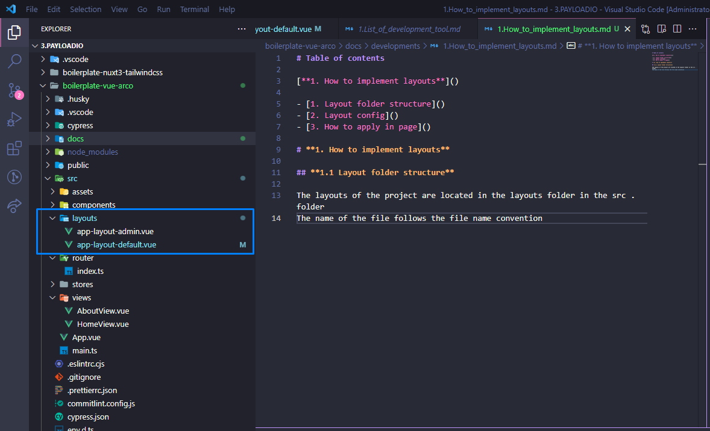

# **Table of contents**

[**1. How to implement layouts**](#1-how-to-implement-layouts)

- [1. Layout folder structure](#1.1-layout-folder-structure)
- [2. Layout config](#1.2-layout-config)
- [3. How to apply in page](#1.3-how-to-apply-in-page)

# **1. How to implement layouts**<a id="1-how-to-implement-layouts"></a>

## **1.1 Layout folder structure**<a id="1.1-layout-folder-structure"></a>

The layouts of the project are located in the layouts folder in the src . folder
The name of the file follows the file name convention



**Example**

```js
// boilerplate-vue-arco\src\layouts\app-layout-admin.vue
// boilerplate-vue-arco\src\layouts\app-layout-default.vue
```

## **1.2 Layout config**<a id="1.2-layout-config"></a>

The layout that will be loaded is implemented directly in `app.vue`

- Initialize `layout` as a `ref`.
- Instead of watching the full `route` object, watch `route.meta?.layout` because that's the only relevant field for the handler.
- Wrap `layout's` new values with `markRaw()` to avoid reactivity on the component definition.

```typescript
const layout = ref()

watch(
  () => route.meta?.layout as string | undefined,
  async (metaLayout) => {
    try {
      const component =
        metaLayout && (await import(/* @vite-ignore */ `./${metaLayout}.vue`))
      layout.value = markRaw(component?.default || AppLayoutDefault)
    } catch (e) {
      layout.value = markRaw(AppLayoutDefault)
    }
  },
  { immediate: true }
)
```

## **1.3. How to apply in page**<a id="1.3-how-to-apply-in-page"></a>

Pages will have a default layout of `AppLayoutDefault`
To make another change to the page, it is necessary to set the layout for the meta attribute in the `router`

```typescript
const router = createRouter({
  history: createWebHistory(import.meta.env.BASE_URL),
  routes: [
    {
      path: '/',
      name: 'home',
      component: HomeView,
    },
    {
      path: '/about',
      name: 'about',
      component: () => import('../views/AboutView.vue'),
      meta: { layout: 'app-layout-admin' },
    },
  ],
})

export default router
```
